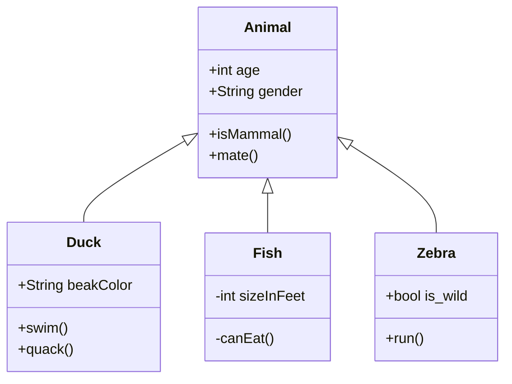

<!---
craigspaterson/craigspaterson is a ✨ special ✨ repository because its `README.md` (this file) appears on your GitHub profile.
You can click the Preview link to take a look at your changes.
--->

## 😂 Here is a random joke that'll make you laugh!

<iframe src="https://player.vimeo.com/video/680855862?h=70b12d8fa4&autoplay=1&loop=1&color=fefefe&portrait=0" style="position:absolute;top:0;left:0;width:100%;height:100%;" frameborder="0" allow="autoplay; fullscreen; picture-in-picture" allowfullscreen></iframe>

