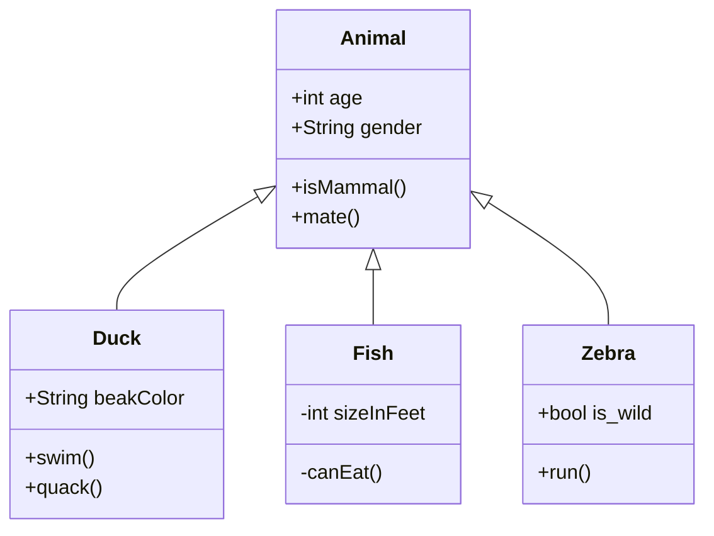

<!---
craigspaterson/craigspaterson is a ✨ special ✨ repository because its `README.md` (this file) appears on your GitHub profile.
You can click the Preview link to take a look at your changes.
--->

## 😂 Here is a random joke that'll make you laugh!

